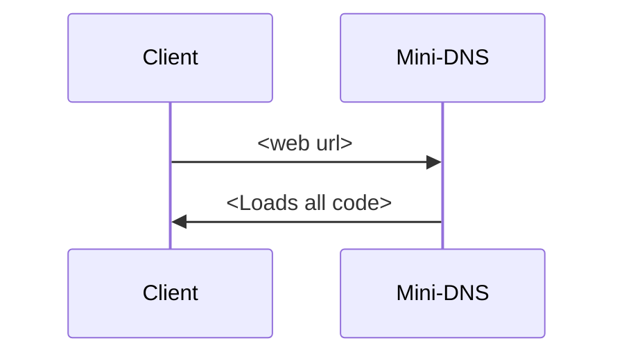
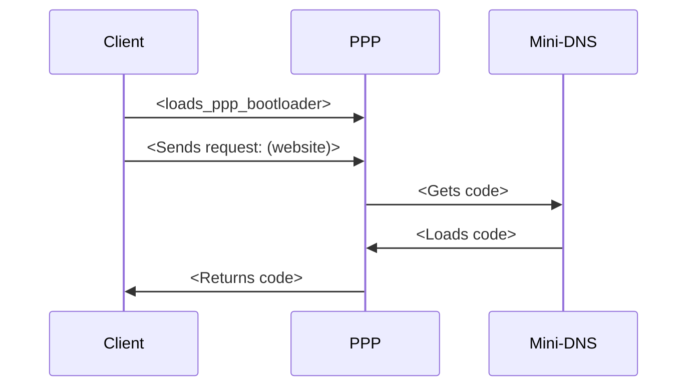

# PML Syntax   

## 1:  Basic syntax
PML syntax is based on two main parts: **Tag** and **Propierties**. 
### Tag
Tag is what defines what you are creating. Right now, it only has **2** tags:
**Text**
**Button**
Every tag has different propierties, listed in a table found in the *element* subdivision.
### Propierties
Propierties define *what*, *how* and *how to be accessed*. 
Some basic propierties are:
**Text**: Defines what text it must show
**Color**: Text color
**Size**: Size of the text
### Elements
Here you can find all the propierties for every tag:
| Element | Propierties|
|-----------|----------|
|Text       | Text, size, color (*RGB*), bold
|Button | Text, size, color (*RGB*), bold, ID (*For Active adressing*)

With this we can create simple PML websites. Down are some examples:

#### Example 1: Welcome!
##### PML
```
text:text=Welcome to my first PML website! =color=0,0,0=size=10=bold=2
```
#### Example 2: Click me!
##### PML
```
text:text=Click me!=color=0,0,0=size=12=bold=2
button:text=Click here!=id=1
```

##### PSS
```
button:size=10=color=0,0,0
```

##### Active
```
1.alert.You clicked me!.click
```

<sub>6/4/2026</sub>

## 2: Description and usage

PML stands for _Pen Markup Language_, and is a direct copy of HTML. It defines the "skeleton" of the website: What and where things are and a little bit of individual style.
>It can be relationed with the bones of the body: define the structure and a little bit of shape, but aren't the final body.

<sub>7/4/2026</sub>


---
# PSS Syntax   

## 1:  Basic syntax
As PML's, PSS syntax is based on two main parts: **Tag** and **Propierties**. 
### Tag
Tag is what defines what you are modifing. Right now, it only has **2** tags:
**Text**
**Button**
Every tag has different propierties, listed in a table found in the *element* subdivision.
### Propierties
Propierties define *what* do you want to change about the element.
Some basic propierties are:
**Color**: Text color
**Size**: Size of the text
### Elements
Here you can find all the propierties for every tag:
| Element | Propierties|
|-----------|----------|
|Text       | Size, color (*RGB*), bold
|Button | Size, color (*RGB*), bold 

We can use this to modify our website's style.
>**Note: PSS styles get overridden by individual PML styles.**

#### Example 1: Welcome!
##### PML
```
text:text=Welcome to my first PML website!
```

##### PSS
```
text:color=0,0,0=size=10=bold=2
```
#### Example 2: Click me!
##### PML
```
text:text=Click me!
button:text=Click here!=id=1
```

##### PSS
```
button:size=10=color=0,0,0
text:color=0,0,0=size=12=bold=2
```

##### Active
```
1.alert.You clicked me!.click
```

<sub>7/4/2026</sub>

## 2: Description and usage

PSS stands for _Pen Style Sheet_, and is a direct copy of CSS. It defines the style of the website: How things without individual style should be shown.
>It can be relationed with the skin of the body: defines how you see it without affecting the logic nor structure.


<sub>7/4/2026</sub>

---

# Active Syntax   
## 1. Basic syntax
Active is probably the most simple language, as always follows the same structure:
> **_Element id.operation.operand.when_**

Here are all current operations:


### Alert
> **_Alert_** is used to display text using the Scratch block "say".
````
1.alert.You clicked me!.click
2.alert.Hovering, please wait.hover
5.alert.Hi!.hover
````

### Request
> **_Request_** is used for doing PPP requests.
 Learn about PPP in the _PPP syntax_ division
 **IMPORTANT**: Request only accepts click, not hover or any other.
````
 1.request.query.click
 3.request.nextlevel.click
 ````
 ### Create
 > **_Create_** is used to create a PML or PSS line
 > _(I have plans of relpacing it with pmlcreate to add flexibility)_
 ````
 pml.create.text:text=hi.onstart
 pss.create.button:color=0,0,0
 ````
### Replace
> **_Replace_** replaces PML or PSS lines for another. Write the complete line to it work properly.
> _(I also want to change this so it can change when clicked a button or something cooler...)_
````
pml.replace.replacethis@bythis.onstart
pss.replace.button:color=0,0,0@button:color=128,128,128
````


<sub>7/4/2026</sub>


## 2: Description and usage

Active is a copy of JS. It defines the interactivity of the website: What happens when you give an input.
>It can be relationed with the nervious system (excluding brain): Sends signals and does basic things, but it's not the brain itself.

<sub>7/4/2026</sub>

---
# PPP Syntax
## 1. Basic syntax

PPP syntax is very similar to Active's. It also uses "." as a separator, but it's scructure can vary depending on the line.

### Start the script
The fist line MUST be this
The first line defines how we access the query. For doing that we write:
````
query.something
````
> _(Actualy, the first part, query, doesn't matter, but must be there)_

So now we will access the query as something or whatever you wrote.

### Do a conditional

The conditional is the base for PPP, as it defines if something should be or not runned. 
It's used the following syntax:
````
something.operation.someelse.if_range
````
#### Explanation:
##### Something:
Defines one parameter
##### Someelse
Defines the other parameter
##### Operation
Defines the operation to decide whatever it's true or false. As PPP is in early development, there are only two operations so far:

 **Equals**
 **Contains**

I think they are pretty self explanatory.
##### If_range
This number defines the total lines the conditional has power on it. 
> For example, if the number is 1 and the condition false, the next line **won't** be executed, but the next one will.

### Return and clear PML
At the moment, PPP can't return PSS or Active, but it can return PML.
To do so, the following syntax is used:
````
pml.return.pmlcode
````

It can also clear whole PML code using ``pml.clear``.

### Load a website
PPP can load a PML website using the ``web_load.weburl`` line. It's the command used for ``ppp://`` protocol.
> This line gets the PML, PSS, Active and PPP code and loads it in the actual website.

_Note: This can indeed be used as a proxy, even if there are no input elements for now. There aren't any restrictions on this at the moment, but soon only webs with allow_all will be able to be accessed (or with the ``ppp://`` protocol with allow_ppp_protocol)_

<sub>7/4/2026</sub>

## 2: Description and usage

PPP is inspired in PHP. It receives requests and return PML concordingly.
>It can be relationed with the brain: Receives input and returns output altering our body

<sub>7/4/2026</sub>

# Create a website
## 1: The workspace
I haven't still created a official place to edit and run your programs, so there are different options. Chose the one you like more to start your project:
- **Google Docs / Word processor:** Write there all code and then put them in the correct list and clic refresh (not hard refresh!) to execute it. 
- **Directly in the lists:** Use the lists as your IDE. Click represh tu run your code.
> **Important:** You can also use the list web(language) to run the code, creating a web searchable for you using a url defined in Web Names. All lines must be separed by \ instead of newlines. (Name, PML, PSS, Active and PPP must be in the same # of index in the lists.

## 2: Coding
This is my favourite part: get the idea and code it!
The idea will be a simple-RPG text game, where you click options to continue the story. It will be indeed simple.

We will start defining the first PML, what you see when you enter the web. 

### PML
````
text:text=RPG Text Game!=size=14=bold=2=color=0,0,0
text:text=Chose on option to continue:
button:text=Run!=id=3=color=0,0,255=size=10
button:text=Attack!=id=4=color=255,0,0=size=10
````
 
 This creates two buttons and a explaining text. Now let's continue with the PSS

### PSS
````
text:size=11=color=0,0,0=bold=0
button:bold=0
````

Defines base styles used when the PML element doesn't have an individual one.

### Active
````
3.request.run.click
4.request.attack.click
````
Makes a "bridge" between PML and PPP

### PPP
````
query.option
options.equals.run.3
pml.clear
pml.return.text:text=RPG Text Game!=size=14=bold=2=color=0,0,0
pml.return.text:text=You have successfully run
options.equals.attack.3
pml.clear
pml.return.text:text=RPG Text Game!=size=14=bold=2=color=0,0,0
pml.return.text:text=You have attacked and won!
pml.return.text:text=You can expand this game easily=size=8
````

This code makes that when you send _run_ with Active it loads something, and when you send _attack_ it shows a victory text.

## 3: Publishing
This part is optional, but I really love to see your webs!
To publish your web into the browser, follow these steps:
 1. **Copy** all the code and paste it in comments, or paste all lines separed with \. Include also the web name, and if you would like it to be able to be accessed by _web_load_ in the future or not.
 2. I will **test** and prepare the code and put it into the lists.
 3. Now, your web will be fully **available**!

# Protocols
This browser has different protocols, every one deisgned for something in particular. Here you can find a list of all actual and possible future protocols: 

## Normal://

This is the basic protocol. You can see how it works in here:




This protocol is used normally in most websites

## PML://

This isn't a real protocol. It works **exactly** as ``normal://``, but this is used for internal websites, like new tab or history.

## PPP://

This protocol is made specially for devs, as it is slower but allows you to see the request in a **future netowrk tracker**, as it uses PPP code as shown here:


The bootloader code is really simple:

```
request.data
web_load.data
```
## Source://

Works as ``normal://``, but this one, instead of showing the web, shows the **source code**. To indicate which language you want to read, simply add ?< language > to the url:
``source://status.pml?pml``
``source://status.pml?pss``
``source://status.pml?active``
``source://status.pml?ppp``

Every url will show the corresponding language source code.

# DevTools
Access the internal tools to debug and optimize your PML websites.

## Inspect
- **Code Viewer:** See the live PML, PSS, and Active code of the current page.
- **Active Console:** Execute Active commands in real-time to test interactivity.

## Origin
- **PTE Debugger:** View the raw data being sent to the Pen Extension Engine. Essential for fixing layout and rendering issues.

## Network Tracker (Coming Soon)
- **Request Monitoring:** Track every request made via PPP or web_load.
- **Timelines:** Visualize how long each resource takes to load.
- **Payload Inspection:** Check exactly what data you are sending and receiving.


